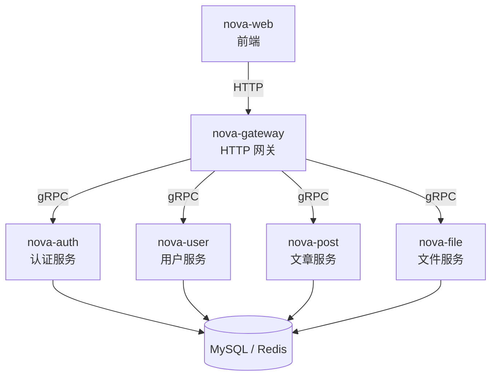

# nova

基于 gRPC 的博客微服务项目，采用 Go 语言开发。

## 项目架构



## 项目结构

```
goc-quickstart
├── nova-contracts/         # gRPC/OpenAPI 契约和生成代码
│   ├── proto/nova/         # Proto 文件 (auth, post, user, file)
│   ├── openapi/            # OpenAPI YAML 文件
│   └── gen/go/             # 生成代码
│       ├── rpc/            # protobuf/gRPC Go 代码
│       └── http/           # OpenAPI server/client/swagger 输出
├── nova-auth/              # 认证服务 (gRPC :50051)
├── nova-user/              # 用户服务 (gRPC :50052)
├── nova-post/              # 文章服务 (gRPC :50053)
├── nova-file/              # 文件服务 (gRPC :50054)
├── nova-gateway/           # HTTP 网关 (:8080)
├── nova-web/               # Web 前端服务 (:8081)
├── nova-apidoc/            # API 文档服务
├── nova-launcher/          # 本地开发 supervisor（make dev）
├── Makefile                # 统一构建管理
└── docker-compose.yml
```

## 服务端口

| 服务         | 端口  | 说明                   |
| ------------ | ----- | ---------------------- |
| nova-gateway | 8080  | HTTP 入口，路由转发    |
| nova-web     | 8081  | Web 前端页面           |
| nova-apidoc  | 8090  | Swagger UI/API 文档    |
| nova-auth    | 50051 | 认证/登录/注册         |
| nova-user    | 50052 | 用户信息管理           |
| nova-post    | 50053 | 文章 CRUD              |
| nova-file    | 50054 | 文件上传与管理         |

## 技术栈

- **语言**: Go 1.26
- **RPC**: gRPC
- **HTTP**: Gin (nova-gateway)
- **数据库**: MySQL + GORM
- **缓存**: Redis
- **依赖注入**: Wire
- **日志**: Zap
- **Proto**: Buf
- **OpenAPI**: OpenAPI Generator
- **容器**: Docker + Docker Compose

## 快速开始

### 前置要求

- Go 1.26+
- MySQL 8.0+
- Redis 7.0+
- Buf CLI (用于 proto 生成)
- Wire (用于依赖注入生成)
- Node.js/npm + Java (用于 OpenAPI Generator)

### 安装工具

```bash
go install github.com/bufbuild/buf/cmd/buf@latest
go install github.com/google/wire/cmd/wire@latest
make openapi-deps
```

### 一键构建

```bash
# 生成 proto/OpenAPI + wire + 编译，一步到位
make proto && make openapi && make wire && make build
```

### 数据库初始化

```sql
CREATE DATABASE goc CHARACTER SET utf8mb4 COLLATE utf8mb4_unicode_ci;
```

各服务的 migration 文件位于 `{service}/deploy/migrations/` 目录。

### 启动服务

```bash
# 方式一：一键启动所有服务（go run，Ctrl+C 原子回收，无孤儿进程）
make dev

# 方式二：Docker Compose
make docker-up

# 方式三：单独启动某个服务
make dev-auth
make dev-user
make dev-post
make dev-file
make dev-gateway
make dev-web
make dev-apidoc
```

### 配置

各服务从 `config.yaml` 读取配置，提供 `config.yaml.example` 作为模板：

```bash
cp nova-auth/config.yaml.example nova-auth/config.yaml
cp nova-user/config.yaml.example nova-user/config.yaml
cp nova-post/config.yaml.example nova-post/config.yaml
cp nova-file/config.yaml.example nova-file/config.yaml
cp nova-gateway/config.yaml.example nova-gateway/config.yaml
cp nova-web/config.yaml.example nova-web/config.yaml
```

`config.yaml` 为本地运行配置，不提交到 Git。mTLS 证书放在各服务 `configs/x509/` 目录，该目录整体忽略。

### 访问服务

- Web 界面: http://localhost:8081
- API 网关: http://localhost:8080
- API 文档: http://localhost:8090 （或查看 `nova-contracts/gen/go/http/swagger-json/swagger.json`）

## Makefile 命令

```bash
make proto              # 生成 proto 代码 + 复制到各服务
make proto-generate     # 仅生成 proto 代码
make proto-copy         # 仅复制生成代码到各服务
make openapi            # 校验并生成 OpenAPI server/client/swagger
make openapi-validate   # 仅校验 nova-contracts/openapi/openapi.yaml
make openapi-generate   # 仅生成 OpenAPI 输出并复制 swagger.json 到 nova-apidoc
make openapi-deps       # 安装 OpenAPI Generator npm 依赖
make build              # 构建所有服务
make test               # 运行所有测试
make wire               # 生成所有 Wire DI
make lint               # 运行 lint
make fmt                # 格式化 Go 代码
make docker-up          # 启动 Docker
make docker-down        # 停止 Docker
```

## License

MIT
